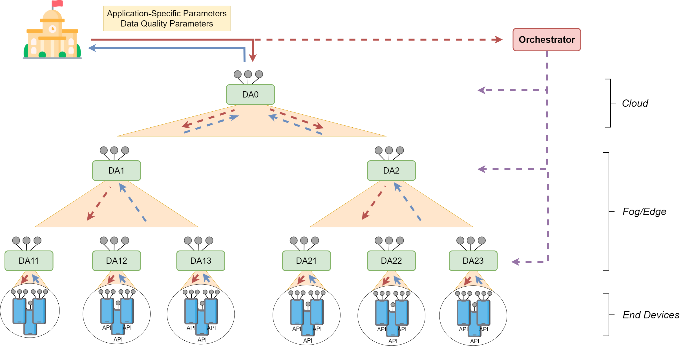

# Demo Smart City - Framework -Elastic Data Analytics

## Architecture Overview

### Scenario

The architecture is formed by the Orchestrator and 9 Data Aggregators distributed in several levels as shown in the image above. At the deepest level, each Data Aggregator has connected 10 virtual mobile devices (60 in total), deployed with [Perses](https://github.com/perses-org/perses).

### Components
- **Orchestrator:** the source code is located inside the *Orchestrator* directory.
- **Data Aggregators:** the source code for one of them is located in the *DataAggregators* directory. The difference between each of them is only in the identification of each one to be able to communicate correctly.
- **End Devices:** The source code of the application used by the end devices is located in the *CitizenHeatmap-Android* directory. The application is also compiled in the root repository as *CitizenHeatmap-Android.apk*.

## Video DEMO

